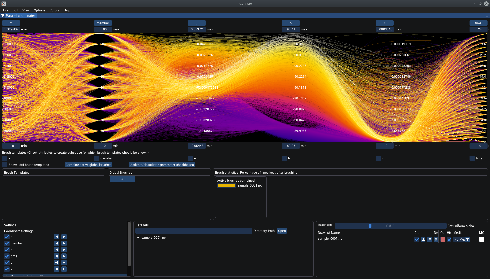
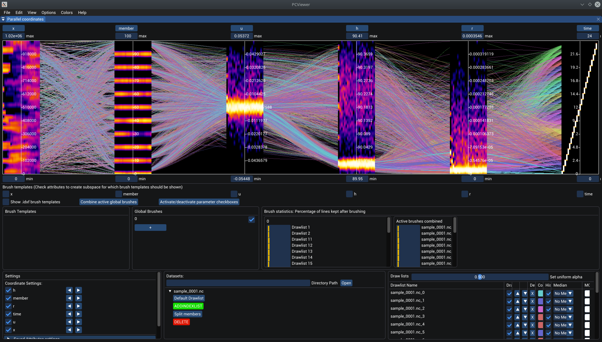
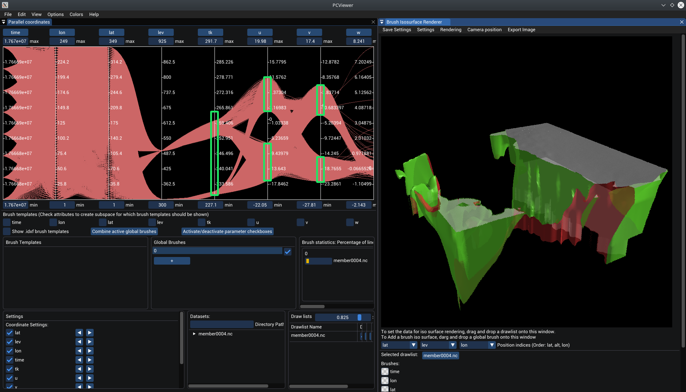
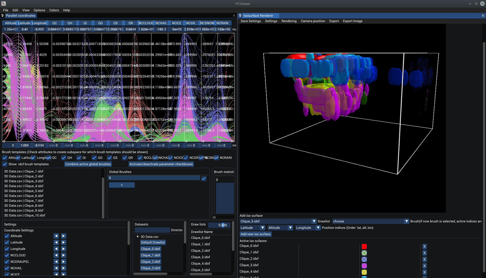
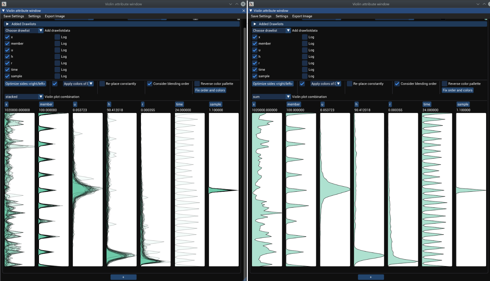

# PCViewer user documentation

Everything you need to know to use the PCViewer application and what it is capable of.

PCViewer is a program to efficiently visualize large datasets and interactiveley explore and compare them. Visualization techniques include Parallel Coordinates Plot with a colorcoded embedded histograms, 3d iso surface rendering, Violin plot drawings, 3d Scatterplots and 3d density visualization. Special emphasize was laid on analysing ensemble datasets providing special visualizations to efficiently compare different members.

For a walk through beginners explanation for an example workthrough can be seen in ...

## Visualization Overview
In the following all visualizations which can be done with the PCViewer are shown.
### Prallel coordinate Plot
The main plot in the PCViewer is a standard Parallel coordinates plot (PCP) which can draw lines as splines or poly lines and stacks multiple datasets on top of each other. For detailed information on the PCP see the [PCP documentation](pcp.md)

To further amplify the information in the parallel coordinates plot for large datasets as well as for a high amount of parallel rendered datasets, at the axes a color coded histogram can be enabled. For detailed information see the [Density Histogram documentation](pcp.md#histogram).

### 3d scatterplot
The first of multiple 3d views is a scatterplot visualization. All datapoints in a dataset are shown at their corresponding 3d position and the size of each drawn point is scaled with its corresponding attribute value. Each attribute can be visualized separately or multiple attributes can be stacked and displayed in different colors. For detailed information on the Scatterplot view see the [Scatterplot documentation](scatterplot.md).

Image for Scatterplot

### 3d Density renderer
The 3d density renderer is a 3d density raymarcher using a transfer function for density color mapping to display 3d density datasets. For more information see the [3d Density documentaion](density.md).

### 3d Iso surface rnederers
The PCViewer supports 2 types of iso surface rendering:
* A direct iso surface renderer which works on the 3d domain of the dataset with the correct attribute values at each grid position

* An approximation iso surface renderer which converts a dataset into a binary field according to the iso surface extraction settings and renders the iso surface in the binary volume.

Both iso surface renderers are explained in detail in the [iso surface documentation](ios.md)

### Violin plotters
For better attribute values distribution visualization two different violin plotters are included in the PCViewer. The detailed description can be found in the [violin plot documentation](violin.md).
The two different violin plotters are:
* An attribute major violin plot which stacks the violin plots of different datasets for each attribute separately.

* A drawlist major violin plot (also called Multi-Parameter ViolinPlot (MPVP)) which stacks for each dataset the violin plots for all attributes.

## Member/Dataset Comparison
A key in the design of the PCViewer was the ability to effectively compare different datasets. Here the comparison value for the different visualisations shall be shown.

## Interactive Data Exploration
A core point of analysing the datasets is to explore subsets and look for special distributions in them. In order brush datasets two different types are available:
* Global Brushes: Global brushes are per attribute defined ranges which leave datapoints `active` when they have an attribute value inside of a brush range. Global Brushes affect all datasets
* Local Brushes: Are the same as Global brushes, however only affect the dataset they are assigned to.

All brush actions can be automatically propagated to all other views of the PCViewer. Note that each view handles disabled datapoints differently. See the documentation for each view how these `inactive` datapoints are handled.
