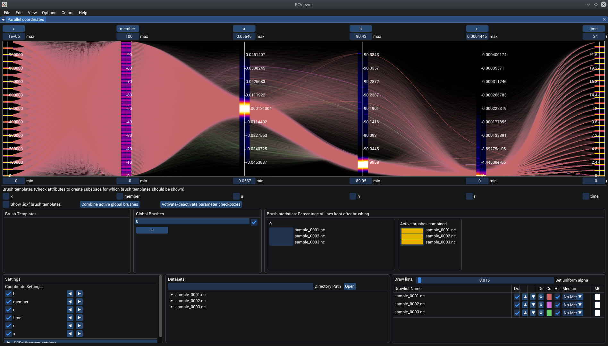
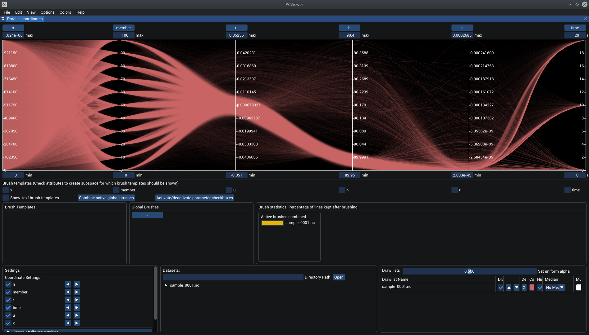
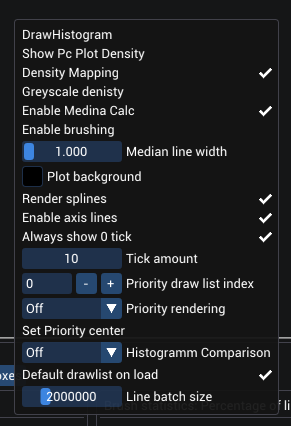
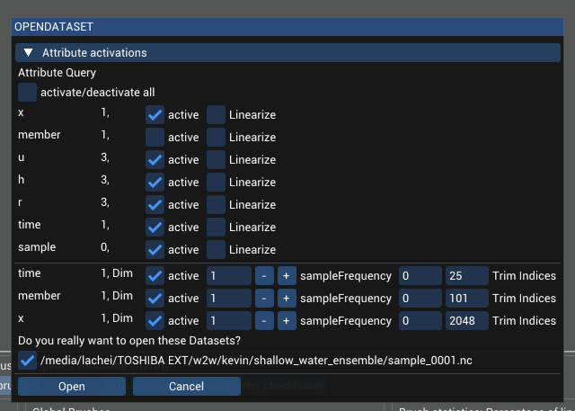
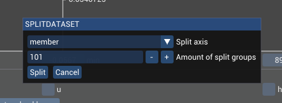
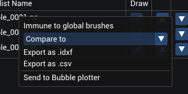

# Parallel Coordinates Plot (PCP) documentation
Here all settings for the PCP view are explained and demonstrated

When multiple large datasets are loaded and display as standard pcp with spline rendering and added stacke histogram one can get a view as the following:

### PCP overview
When the PCViewer application is opened without any data, the following can be seen.

The basic structural elements of the main window are:
1. Menu bar where special settings can be found. All are explained in detail in the [Menu bar section](#menu-bar)
2. Main parallel coordinates plot view. Capabilities are described in section [parallel coordinates plot](#parallel-coordinates-plot).
3. Global brushes section. Details on global brushes and general brushing can be found in the [brushing documentation](brushing.md).
4. Settings section for the pcp plot. All details are described in section [parallel coordinates settings](#parallel-coordinates-settings).
5. Dataset section to manage datasets. See the [dataset section](#datasets) for details
6. Drawlist section to manage the drawlists. See the [drawlist section](#drawlists) for details

## Menu bar

The menu bar contains the following settings:
1. **File**: File settigns which includes an ``open`` menu for opening a folder or a discrete file, an ``Open recent`` for opening a recently opened file (Maximum 10 files are stored currently), and an ``Export`` menu for exporting the current window as png.
2. **Edit**: The edit menu contains all settings for the window style such as, frame border, frame rounding, frame colors, and so on. In the top there exist three menu items to load and save custom styles and setting the default style. Just below these menu items is a dropdown menu called Colors which has preset color styles from which one can choose. By default ``Dark`` is chosen.
3. **View**: The view menu contains all additional workbenches to visualize the data. The available workbenches are: [Bubbleplot workbench](scatterplot.md), [3d View](density.md), [2 Iso surface workbenches](iso.md), and [2 Violin plot Workbenches](violin.md).
4. **Options**: Here general options for brushing, brush fractioning, animation and image exportion can be found. In the top a section for storing the pcp settings, loading stored ones and selecting a default setting can be found. ``Activate Global Brushing`` activates global brushing, ``Brush combination`` sets how multiple global brushes are combined (via and or or on active lines) and ``Mu add factor`` is the fraction amount to be added/substracted to the global brush bounds when using the mouse wheel on a brush. ``Max fraction depth`` sets the maximum depth of the kd-tree which splits a specific global brush into its factures, ``Outlier rank`` sets the threshold for which a kd-tree node is deemed an outlier, ``Bounds behaviour`` specifies the behaviour of the boundaries of the hypercube when split, ``Fractionbox width`` is the width of the renderd fraction boxes, ``Fractionbox linewidth`` the linewidth of the fraction boxes, ``Multivariate std dev thres`` is the threshold for the multivariate gauss distribution inside the fraction boxes until which a line is assumed to be contained in a fraction. More on that in the [Global brush documentation](brushing.md#global-brushes).On using and capabilities of animations see the [animation section](#animation). ``Animation duration per step`` is wait time for each animation step until the animation continues, ``Export animation steps`` is a checkbox to automatically export the animation steps as png's and ``Export path`` specifies the export location for the animation images. Put a ``%d`` in the filename to specify where the export image index should be put. Via the ``Brush to animate`` combo selection one can select the global brush wich should be used for brush animation, ``Attribute to animate`` specifies the attribute on which the brush animation should be run, ``Steps amount`` specifies the amount of animation steps and the axis division size. The last section then specifies settings for the image export. ``Size multiplicator`` sets the multiplicator with which the window size is multiplied to get the pixel size of the export image. This size can be seen in the line below. Below that one can specify an export file path and export an image form the current widow to the specified filename.
5. **Colors**: The colors menu provides the ability to store colors and load them. To store simply drag and drop a color from anywhere in the application onto the `Colors` menu (Drop indicator will show). Then a popup modal window appears to input a name for the newly saved color. When the color is saved it appears under the `Colors` menu. To load a color simply drag and drop your color out of the list and onto the color field in the application to set the corresponding color.
6. **Help**: The Help menu contains a menu entry which gives you the link to this documentation.

## Parallel coordinates plot
This is how the preset view of a loaded dataset looks like:

On top of the pcp, labels for each axis are displayed showing the name of the attribute.
In the following the different interactions are shown, while the default parameters when loading a dataset are explained in detail in the [data loading section](data.md#data-loading).
#### Attribute aliases
As often attribute names are very long and cannot be displayed completely in the labels, one can assign an alias by double clicking on the label, entering the alias and pressing enter. If an alias is assigned the original name is displayed when hovering over the axis label. To get the original name back simply double click again on the axis label and the original name is automatically inserted. After pressing enter the alias is reset.

Note that for all other workbenches the alias is automatically also used.

#### Attribute switching
A very important problem about pcp's is that correlations between attributes can only be directly perceived when the correlated axes are placed next to each other.

Further often it is very practical to group attributes according to their type (eg. positional, 3 dimensional, 2 dimensional ...) to get a quicker overview when enabling overlayed stacked axes histograms.

In order to arrange the axes in any order you want the PCViewer supports two kinds of axes reordering:
1. **Axes-Switching**: To switch the place of two attributes simply drag and drop one axis label onto another one. On drop both will be switched.
2. **Axes-Shifting**: When holding down the `Ctrl`-key on dropping an axis, the dragged axis is pushed into the axis space it was dropped in and all axes between the new axis position and the old axis position are shifted towards the old position.

The following figure shows the two different types for attribute switching:

#### Attribute min/max
Below the axis label is a drag float box which controlls the maximum axis value. Below the pcp another drag float box is positions which controlls the minimum axis value. To change these simply either
1. **drag** the value to increase or decrease it,
2. **double click** on the value to insert a certain min/max value,
3. **hover over the axis, press the `Ctrl`-key and scroll** with the mouse wheel to zoom in or out of the axis (lower/higher min value + higher/lower max value simultaneously)
4. **hover over the axis, press the `Alt`-key and scroll** with the mouse wheel to shift the axis up or down (lower/higher min value + lower/higher max value simultaneously).

All changes except the insertion of a certain number are automatically scaled using the difference between the min and the max value.
Further note that one can also invert an axis by inserting the max value into the min value and vice-versa. The PCViewer application is designed to cope with inverted axes.
#### Saving Attribute Settings
In order to save the attribute settings including axes ordering, axes scales, axes activations one can either simply press `Ctrl+S` or go into the `Attributes` menu in the [menu bar](#menu-bar) and click the `save` menu item. In the popup simply enter a name for the settings and click save permanently save it.

To load a saved attribute settings go to the [parallel coordinates settings](#parallel-coordinates-settings) and click on the setting you want to load. The loading of an attribute settings includes a safety check if the setting is applicable to the current data structure.

#### PCP right click menu
Most parallel coordinates settings can be accessed by right clicking on the pcp. The following menu opens up:

The settings do the following:
- **DrawHistogram** activates the stacked histogram overlay for the axes (details in the [overlayed axes histograms](overlayed-axes-histograms)).
- **Show Pc Plot Density** activates pcp density few. Not adviced as this visualisation was abandoned due to lack of information retrieval
- **Density Mapping** activates density color mapping. Density is mapped to heatmap colors according to the density.
- **Greyscal density** actives greyscale density mapping instead of color mapping. If density and greyscale mapping are active, greyscale density is shown.
- **Enable Median Calc** can be used to deactivate median calc.
- **Enable brushing** does not affect anything(dead).
- **Median line width** sets the width for the median line.
- **Plot background** can be used to set the background color of the pcp. The axes color is automatically set to be the inverse of the background color.
- **Render splines** selects whether splines (smooth lines) or polylines are drawn.
- **Enable axis lines** activates axis lines.
- **Always show 0 tick** can be activated to enforce 0 axis tick if min < 0 < max. Automatically removes on standard tick from the axis.
- **Tick amount** sets the amount of ticks per axes (A tick is a value indicator on the axis).
- **Priority draw list index** sets the index of the drawlist which is rendered with priority colors. More information to priority renderin in section [priority rendering](#priority-rendering)
- **Priority rendering** dropdown can be used to activate priority rendering for an axis, or can be used to deactivate priority rendering.
- **Set Priority center** enables the user to specify a priority center on an axis by clicking where the center should be set.
- **Histogram comparison** enables to show the difference between one histogram and the rest of the stacked histograms.
- **Default dralist on load** If active for each drawlist loaded a defeault drawlist containing all datapoints of the dataset is created automatically.
- **Line batch size** sets the maximum line amount issued by a single command buffer. If a VkError -4 is reported when the lines should be renderd, reduce this amount.

#### Overlayed Axes Histograms
In order to better analyse the different distributions of drawlists for each attribute one can overlay a stacked color coded histogram at the attribute axes.

#### Priority rendering

## Global Brushes

## Parallel Coordinates Settings

## Datasets
In the dataset section one can manage all loaded datasets. Here only the standard user interactions are shown, for a more detailed explanation see the [data documentation](data.md).

In the top of the dataset section one can enter a directory path to load all supported files contained in the entered folder, or insert the explicit path to a single file to be opened. Alternativeley one can simply drag and drop teh files onto the application.

### Dataset loading
When a file should be opened, the open dataset filedialogue will appear:

On default the ``Attribute activations`` header will be closed, so in order to get to this view simply click on the header.

Here one can pre select the attributes which should be loaded for the dataset. In the list first the name, then the amount of dimensions it is dependant on and then a checkbox for activating/deactivating it are shown. If the ``Linearize`` checkbox is ticked, the attribute values are linearized in the range of their corresponding min/max values, meaning that the attribute values are analysed, groups of data points with the same attribute values are formed, and these groups then get a linear value between min and max according to their index in the sorted group values array.

To quickly activate/deactivate all attributes simply use the checkbox at the very top.

Then bleow a separator a list of all found dimensions is shown. Here one can activate/deactivate, set a sample frequency or trim the dimension indices for the dimensions. If a dimension is deactivated, one has to set a cut index, as currently dimension reduction is done by slicing along the specified dimension index.

For csv datasets only a single default dimension is shown which describes the rows of the data table.

Then there follows a list showing all datasets which are recognized to be loaded. Each dataset can be activated separateley to deactivate its loading.

Loading datasets can be started by pressing ``Open`` or cancelded with ``Cancel``.

### Dataset Listing
After datasets have been loaded they are shown in the data set list:

For each Dataset a collapsable header in the list, which can be opened to access dataset actions:
- Create a drawlist from an ``IndexList``: All available indexlists are shown in the top of the collapsable header and can be clicked to be converted to a ``DrawList`` by clicking on the button. The ``Default Drawlist`` indexlist creates a drawlist showing all datapoints in the dataset.
- ``ADDINDEXLIST`` opens a popup where special indexlists for a drawlist can be added. These indexlists can be used for loading clusters in datasets without having to load each cluster as a new dataset. For more information go over to the [data documentation](data.md).
- ``Split members`` opens a popup to split a dataset on one attribute into severla members. 
Here one can spcifiy the axis on which the split should be done and the amount of groups that should result in the split. The dataset is then split linearly into ``n`` groups and for each group a drawlist is created.
- With ``DELETE`` the dataset can be deleted.

## Drawlists
Drawlists are the drawable instances which can be seen in the PCP. 

In the PCViewer application data is split into its loaded representation, simply called a ``Dataset``, and a drawable representation, called ``Drawlist``. This has the advantage that for one dataset multiple drawable instances can be created, and each of the instances can be manipulated (eg. data subselection) to show different aspects of the data and can be simultaneously compared without having to load the data twice, which would in return increase the memory footprint. Further, if clustering or other data subselection was imposed externally on the dataset, the resulting subselection can be added via a indexlist which contains only the indices for the data subselection, which removes the need of loading an extra dataset for the subselection (More information about indexlists in the [data documentation](data.md)).

By standard, for each dataset loaded automatically a drawlist for the whole dataset is generated (Can be changed in the right click menu of the PCP or in the ``Options`` menu via the ``Default drawlist on laod`` option). Alternativeley a drawlist can be created by clicking on one of the template lists in a dataset (see [Datasets](#datasets)).

For each created Drawlist one entry in the Drawlists section is shown:

In the very top a float slider is available to set the alpha value (opacity value) for all drawlists uniformly.

- In the list below then all drawlists are listed. First the drawlist name is shown which is a selectable. One can select multiple drawlists at once via holding the ``Ctrl`` or ``Shift`` key. Selecting is used for interaction with other workbenches or for applying a ``Local Brush`` (local data subselection) to a drawlist (see the [brushing documentation](brushing.md#local_brushes) for more information on brushing).

- The next column shows checkboxes for drawing the drawlist. If not activated, the drawlist is not drawn. **Note** that this only affects the parallel coordiantes plot drawing, not the histogram drawing of the drawlist.

- Then follow two columns with arrow buttons which can be used to change the order of the drawlists. This is important, as the drawlist that resides on the top of the list is always drawn on top, the second drawlist in second place and so on. For larger datasets the stacked view of the drawlist often occludes drawlists in the back, making it hard to trace lines from these drawlists.

- Next is a delete button to be able to delete a drawlist completely.

- To visually adopt the appearance of a Drawlist, one can change the color for each drawlist by clicking on the color picker and selecting a custom color. Alternatively one can load a stored color by dragging a stored color of the ``Colors`` menu onto the color picker to set it.

- In the next column one can deactivate the drawing of the histogramm for the drawlist. **Note** that this only affects the histogramm drawing, not the pcp drawing of the drawlist.

- Next one can select if a median line should be shown. One can show the ``Synthetic`` (aka median) or the ``Arithmetic`` (aka mean) line for each drawlist. On brushing the dataset these lines are reset to not be shown as they have to be recalculated.

- And in the last column one can set the linecolor for the median line.

Right clicking on a drawlist opens the following menu:

- ``Immune to global brusehes`` sets the drawlist immune to global brushes, meaning that global brushes are not applied to this drawlist.
- In the compare to dropdown one can compare two drawlists with respect to their sizes, union, intersection and difference.
- ``Export as .idxf`` exports the active lines of the drawlist to an ``.idxf`` file. This is the fileformat for ``Indexlists`` which can be lodaded into an dataset.
- ``Export as .csv`` exports the active lines to a .csv dataset.

## Animation
Here Explanations concerning the animation capabilities are given.

Animation here is mainly meant as an automatic run through different visualizations in the PCP. Available animations are:
1. Automatic Drawlist animation, and
2. Automatic Brush animation

### Drawlist Animation

### Brush Animation

## Further read
