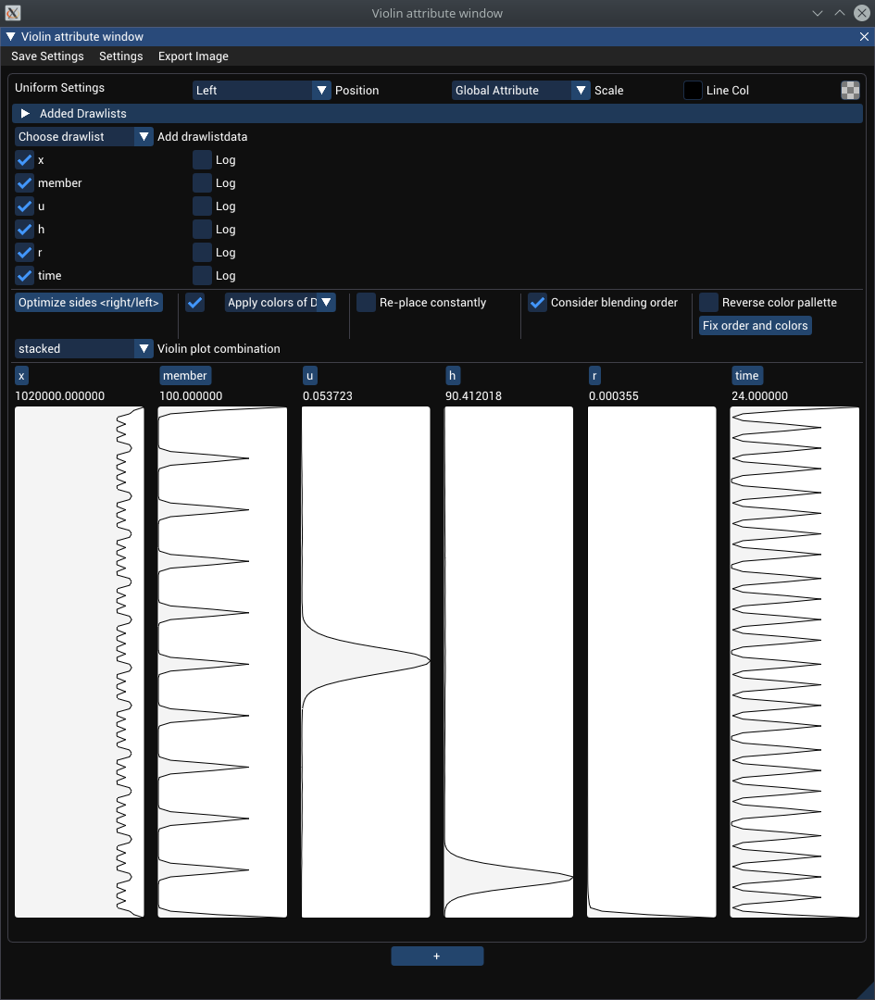

# Violin Plot Documentation

In order analyse the value distributions for different axes two Violin plotters are available:
- An [attribute major](#attribute-major) violin plotter, which groups the drawlist violin plots by attributes and shows them stacked and
- a [drawlist major](#drawlist-major) violin plotter, which groups the drawlist voilin plots by the drawlists and shows them stacked.

## Attribute Major
The first type of violin plotter is the so called Attribute Major plotter. The window for this can be shown by going in the main window menu bar on ``View->Violinplot workbenches->Violin attribute major``. In the new window click on the "+" button to add a new violin plot environment. Then drag and drop draw lists from the pcp onto the attribute major plot environment.

After having added a single drawlist one coud see something like this:

In the menu bar one can find the settings for the violin plot(Obvious settings are skipped):
- **Couple to Brushing** If active automatically updates the violin plots if a brush is updated
- **Show Attribute min/max** Activates min/max labels above and below the violin plots.
- **Violin plots height** Sets the height of the violin plots.
- **Violin plots x spacing** Sets the horizontal distance of between violin plots.
- **Violin plot line thickness** Sets the line thickness of the plot lines.
- **Ingore zero values** If checked, all values at an axis with value 0 will be ignored
- **Ingor zero bins** If checked, all bins of the histogram which contain 0 values will be set to 0
- **Smoothing kernel stdDev** Sets the standard deviation for the smoothing kernel used to smooth the histogram
- **Y Scale** Dropdown to select violin plot histogram scaling. One can for example only show the brush range on teh violin plot scale to have a zoomed in effect for visualization.
- **Overlay lines** Overlay violin plot lines over the filling when the plots are stacked

In the violin plot window in the top one can find uniform settings, which sets for all drawlist the corresponding setting uniformly.

Position denotes the violin plot placement, Scale width scaling for the attributes and last are two color pickers for specifying a line and a fill color.

To set attributes for each drawlist differently one can open the collapsable header ``Added Drawlists``. The same settings as for uniform settings are available.

Then all attributes are listed, which can be activated and deactivated to select only useful attributes to be shown. Also for each attribute log scaling can be activated.

Below comes a listing for automatically applying colors to the violin plots.

Before the plots are shown is a drop down to switch between the "stacked" and "summed" view. Stacked means that for each attribute all violin plots for all added drawlists are shown at the same time, while summed means that all violin plots are added up.

Then all violin plots are shown, axes can be switche via drag and dropping the axis labels (just as for the pcp).

A resulting stacked (left) and summed (right) view with multiple drawlists can look something like this:

## Drawlist Major
The second violin plotter available is called the drawlist major plotter.

In contrast to the attribute major plotter, here for each drawlist the violin plots are grouped together and displayed stacked.
